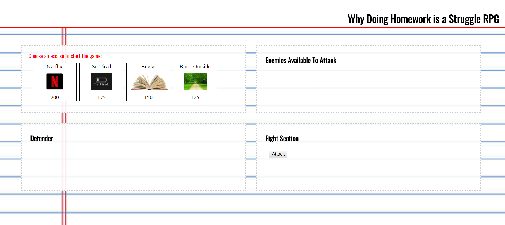

# Why Doing Homework is a Struggle RPG
Link to game: https://elspetha5.github.io/week-4-game/

This game is all about which distraction is the strongest enemy of doing real work. Here you'll battle Netflix, Books, Tiredness, and Outside to find out which one is the most distracting.

## The Rules
1. Pick a distraction
2. From the enemy list, pick the first defender
3. Attack defender until either his health points equal 0, or yours do
  1. Notice that your attack power increases with every attack, while your defender's stays the same
4. Pick wisely, each character has a different attack power, so you'll have to be strategic if you want to win